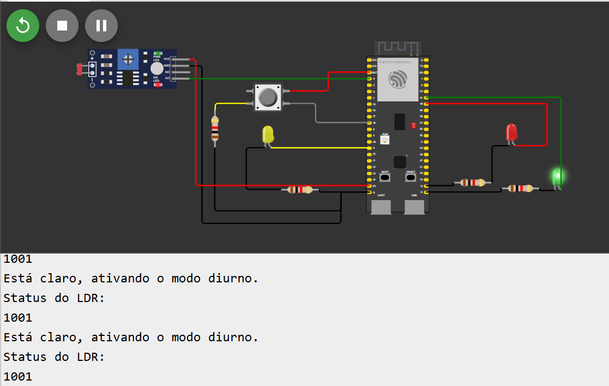
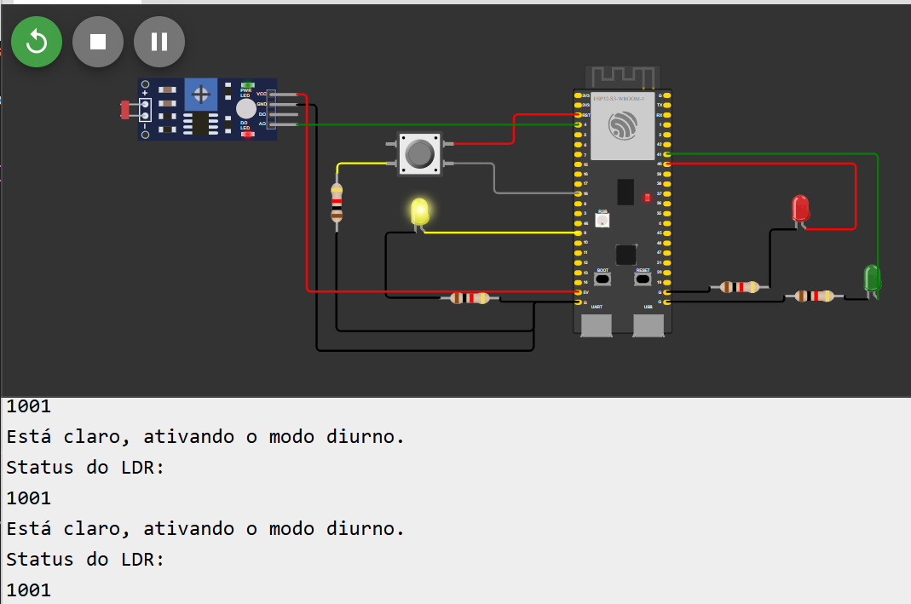
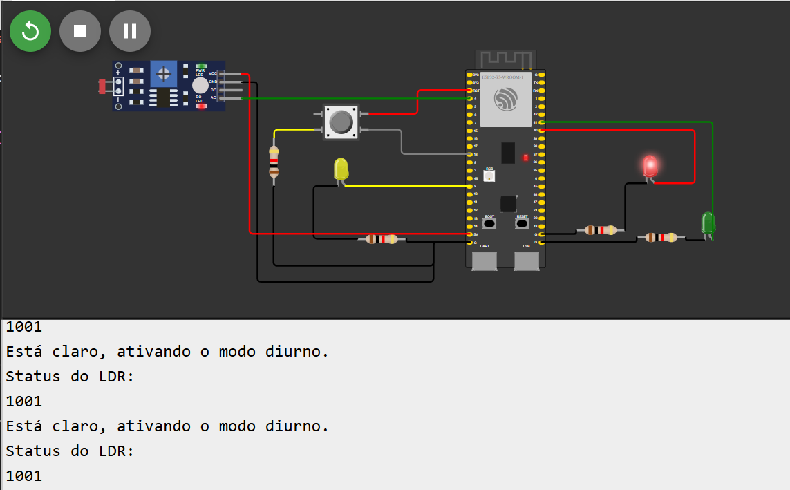
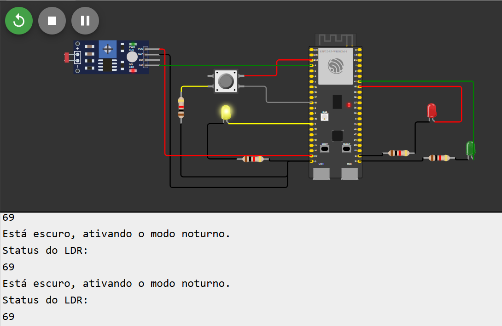

# Prova Módulo 4 - 2024

Neste repositório, encontra-se o código desenvolvido na parte prática da prova do módulo 4 de 2024 do Inteli.
Também, estarão abaixo as fotos comprobatórias dos estados do protótipo.

## Estados do protótipo
O protótipo possui dois estados: o noturno e o diurno. Ambos funcionam a partir do status do LDR.

### Modo diurno
O modo diurno possui o funcionamento normal do semáforo, onde os leds verde, amarelo e vermelho acendem e apagam em sequência.

Figura 1 - Led verde aceso e outros apagados

Fonte: Material produzido pelos autores (2024)

Figura 2 - Led amarelo aceso e outros apagados

Fonte: Material produzido pelos autores (2024)

Figura 3 - Led vermelho aceso e outros apagados

Fonte: Material produzido pelos autores (2024)

### Modo noturno
O modo noturno possui o funcionamento somente do led amarelo, o qual pisca a cada 1s.

Figura 4 - Led vermelho piscando

Fonte: Material produzido pelos autores (2024)

## Debounce
O debounce ocorre por um ruído causado na leitura do botão. Para isso, foi implementado o debounce via software no código do protótipo.

## Requisição HTTP
A cada vez que alguém aperta o botão 3 vezes, uma requisição do método GET é enviada a um site.
